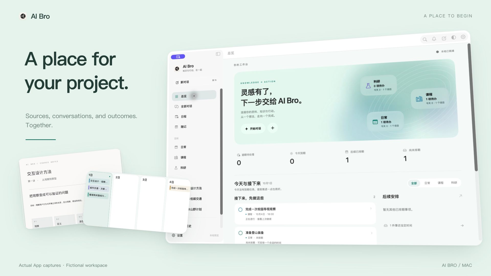

<p align="center"></p>
<h1 align="center">AI Bro</h1>
<p align="center"><strong>Turn a conversation into work you can continue.</strong></p>
<p align="center">Sources to return to. Changes to review. A next step to take.</p>
<p align="center"><sub>NATIVE MAC WORKSPACE · LOCAL FIRST · YOUR MODELS · OPEN SOURCE</sub></p>
<p align="center"><a href="README.md">简体中文</a> · English</p>
<p align="center"><a href="https://github.com/zihenghe04/AIBro/releases/tag/v0.8.0"><strong>Download the Mac preview ↗</strong></a> &nbsp; · &nbsp; <a href="https://zihenghe04.github.io/AIBro/?lang=en">Explore the product workflows</a> &nbsp; · &nbsp; <a href="CHANGELOG.md">Changelog</a></p>

[](https://zihenghe04.github.io/AIBro/?lang=en)
<p align="center"><sub>Actual AI Bro 0.8.0 App interface, captured from an isolated demo workspace. Projects, documents, and responses are fictional; animations arrange interface steps and do not represent live model speed. <a href="https://zihenghe04.github.io/AIBro/?lang=en#workspace">Explore the workflows ↗</a></sub></p>

Some work deserves more than a place in your chat history.

AI Bro is a personal knowledge and action workspace for Mac. Bring a handout, a paper, a note, or a plan into a project. Read, discuss, and refine it with AI. Keep the resulting documents and next steps together, ready for the next time you return.

**0.8.0** brings clearer project navigation, a fuller document and review workspace, and connected learning, research, task, and calendar workflows. This is a development preview for Apple Silicon / macOS 14+, not yet Apple-notarized. [Release notes](docs/RELEASE_NOTES.md)

---

## See AI Bro in motion

[](https://zihenghe04.github.io/AIBro/?lang=en#film)

[▶ Watch the 42-second product film](https://zihenghe04.github.io/AIBro/?lang=en#film) · [Download MP4](https://zihenghe04.github.io/AIBro/assets/film/promo-en.mp4) · [Composition source](launch/film/)

An original React + Remotion film with animated typography, camera framing of actual App screenshots, and an original soundtrack. All example materials are fictional; this is not a continuous recording or a live model run.

## Read. Make it your own. Move it forward.

### 01 &nbsp; Think with your sources beside you.

Open the original PDF, follow a citation, and keep asking questions alongside it. Documents have their own tabs and an adjustable reading area. Switch projects, consult a note, and find your way back.


- **Connected material and conversations**: import PDFs, Markdown, and other supported files; reference them in chat and return to the original source.
- **Room to read**: document tabs, PDF navigation and search, fit-to-width or fit-to-page, and focused or side-by-side reading.
- **Work you can use again**: open saved notes from project outputs without searching through a long conversation.

### 02 &nbsp; AI suggests a change. You decide what stays.

Move from reading to writing, and from a suggestion to a review. Shape the draft in your own words, with a clear view of what changed and what was saved.


- **Two ways to write**: Milkdown visual editing and CodeMirror source mode, with common lists, tables, code, math, and images. Full source remains available.
- **Changes you can inspect**: file diffs, side-by-side views, individual changes, and draft acceptance. Continue editing after saving.
- **Continuity**: document positions and drafts, undo within the current editing session, and explicit version-conflict and save-failure feedback.

### 03 &nbsp; Give the next step a place to happen.

A note can become a plan. A discussion can leave a task. Projects keep the material, the outcome, and the action on the same line of work.


- **A clear home for each project**: conversations, sources, outputs, tasks, scheduling, and overview share consistent navigation.
- **A practical next step**: checklists, boards, project schedules, due dates, recurring events, reminders, and ICS import.
- **A way back**: execution records, source links, version history, and a trash view for supported content.

<p align="center"><a href="https://zihenghe04.github.io/AIBro/?lang=en#workspace"><strong>Explore the complete product workflows ↗</strong></a></p>

## Made for work that builds on itself

| Learning | Research | Everyday projects |
| --- | --- | --- |
| Keep handouts, chapter notes, and revision tasks around a course. Check the original, develop your understanding, and ask the next question. | Keep papers, methods, experiments, and open questions in a research project. Connect knowledge with sources in Research Wiki, reviewing drafts before incorporating them. | Capture an idea or link. Develop it into a document, checklist, or calendar entry. Return to the same work when plans change. |

## Your models. Your ongoing work.

Connect a compatible API or a locally configured official Codex CLI, and choose a model per conversation. Skills, project plans, and memory help reuse workflows and context. Tool support, attachments, and reasoning options depend on the provider. AI Bro does not include a model subscription or API credits.

Your workspace is stored on your Mac by default. Reading, editing, organizing material, and managing tasks do not require a sync server. Requests to remote models or online tools send the necessary content to the service you select.

For multiple devices, connect your own sync service over HTTPS or an SSH tunnel to push and pull supported workspace content. SSH provides the connection; the sync account establishes content ownership. Model credentials and local-folder permissions are not included in workspace sync. [Models and local data](docs/DESKTOP_APP.md) · [Self-hosted sync](docs/CLOUD_SYNC.md)

## Start with one document

1. Download the DMG and checksums from [v0.8.0 Releases](https://github.com/zihenghe04/AIBro/releases/tag/v0.8.0), following the [installation guide](docs/DISTRIBUTION.md). Python and PDF support are bundled.
2. Connect your model service in Settings and select a model.
3. Create a project, add a document, and start a conversation.

> Summarize the core ideas in this handout, include source page references, save a learning note, and suggest three revision tasks.

<p align="center"><a href="https://github.com/zihenghe04/AIBro/releases/tag/v0.8.0"><strong>Download AI Bro for Mac ↗</strong></a> &nbsp; · &nbsp; <a href="https://zihenghe04.github.io/AIBro/?lang=en">See how it works first</a></p>

<details>
<summary><strong>Preview boundaries and data handling</strong></summary>

The current focus is the Mac App. Full VoiceOver paths, input-method composition, very long documents, and large libraries remain areas of active work. Visual editing supports common Markdown structures; source mode preserves access to extensions. Restoring a document and its draft does not preserve the entire undo history across restarts. Whether an AI task produces a file depends on its actual execution result.

The default workspace directory is `~/Library/Application Support/ai-workstation`. Native credentials use a separate locally encrypted file. Its key and ciphertext are stored under the same user account, so this does not protect against processes that can read that directory. Sync propagates changes and deletions and is not a backup. The sync server can read synchronized content; end-to-end encryption is not currently provided. See [credential storage](docs/DESKTOP_APP.md) and [sync, conflicts, and backups](docs/CLOUD_SYNC.md).

Remote agents, remote file management, and real-time multiplayer collaboration are outside the current scope. Older platform builds are listed in [release history](https://github.com/zihenghe04/AIBro/releases). Promotional demos use original fictional content, with no personal documents, credentials, or service addresses.

</details>

<details>
<summary><strong>Build from source and contribute</strong></summary>

A SwiftUI / AppKit native shell, a WKWebView workspace, and a local Python service. Development requires an Apple Silicon Mac, Xcode 26, Node.js 24, and Python 3.12.

```sh
git clone https://github.com/zihenghe04/AIBro.git
cd AIBro
npm ci
python3 -m venv .venv
. .venv/bin/activate
python -m pip install -r requirements.txt
npm run start:native
```

The source preview uses `.aibro-native-preview.noindex/workspace` beside the repository, separately from the installed App. Its launcher does not automatically select an active `.venv`; see the [runtime and build guide](docs/DISTRIBUTION.md). After changing UI or editor sources, run the relevant `npm run build:ui`, `npm run build:editors`, or `npm run build:document-markdown`. Native releases use `npm run release:mac`.

[Install and build](docs/DISTRIBUTION.md) · [Architecture](docs/ARCHITECTURE.md) · [Contributing](CONTRIBUTING.md) · [Third-party sources and licenses](docs/THIRD_PARTY.md)

</details>

---

<p align="center">Keep what you learn. Continue what you started.</p>
<p align="center"><a href="LICENSE">AGPL-3.0-only</a> · <a href="https://github.com/zihenghe04/AIBro/issues">Feedback</a> · <a href="CHANGELOG.md">Changelog</a></p>
