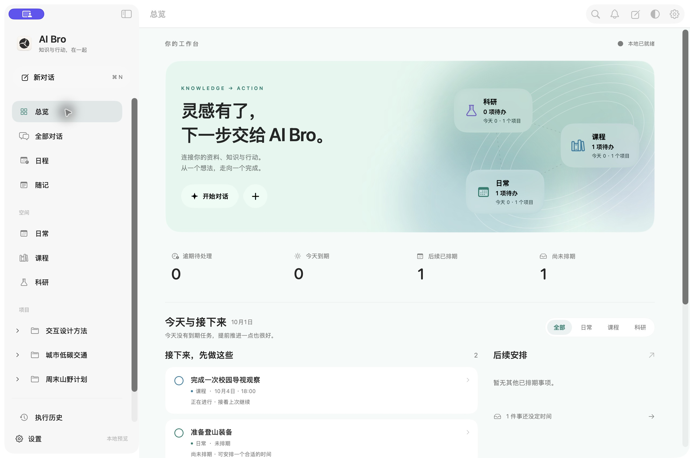
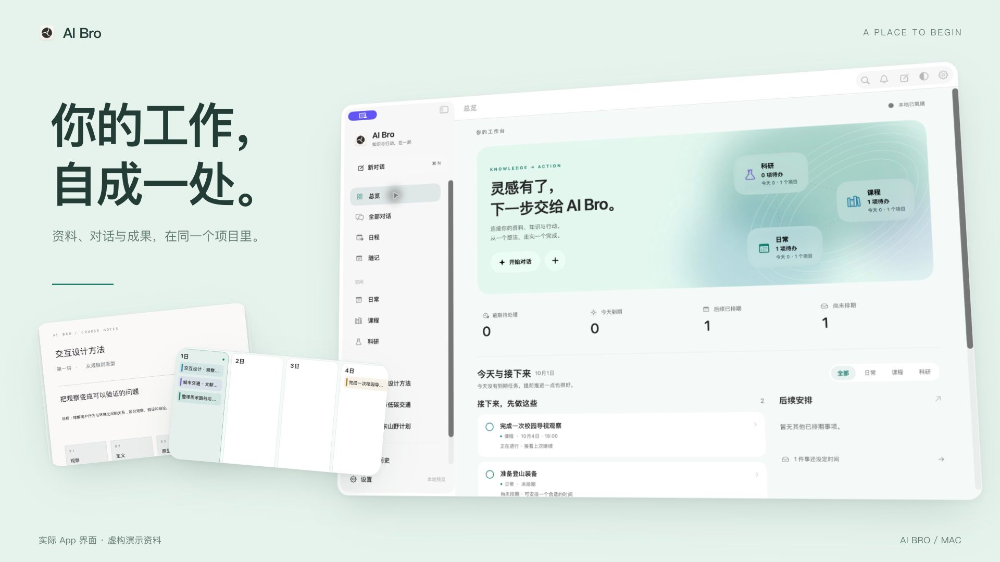
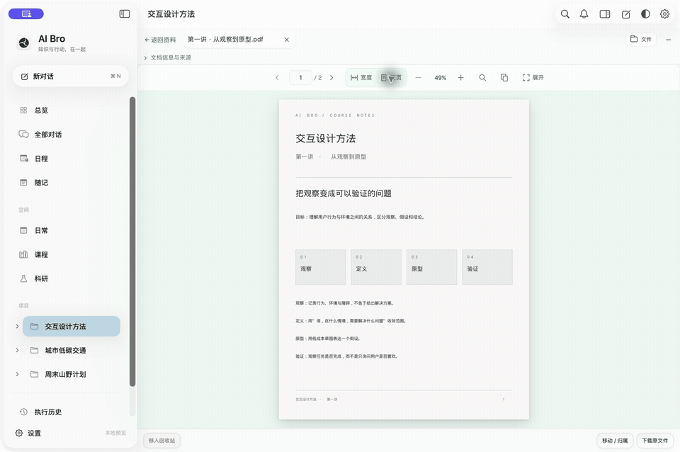
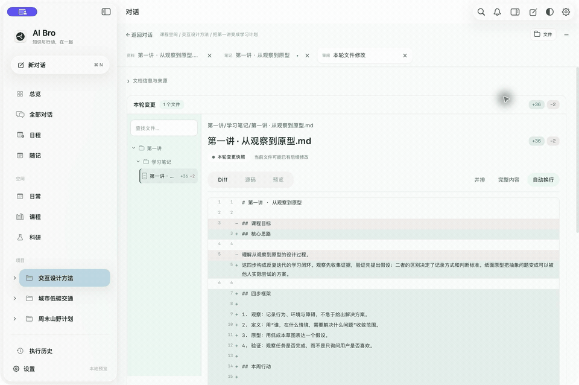
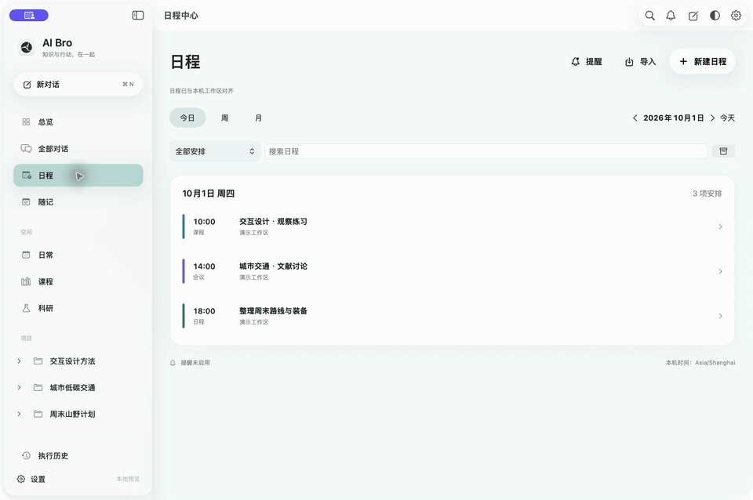

<p align="center"></p>
<h1 align="center">AI Bro</h1>
<p align="center"><strong>把一次对话，变成可以继续的工作。</strong></p>
<p align="center">资料有来处，修改有记录，想法有下一步。</p>
<p align="center"><sub>MAC 原生工作台 · 本地优先 · 自选模型 · 开源</sub></p>
<p align="center">简体中文 · <a href="README.en.md">English</a></p>
<p align="center"><a href="https://github.com/zihenghe04/AIBro/releases/tag/v0.8.0"><strong>下载 Mac 预览版 ↗</strong></a> &nbsp; · &nbsp; <a href="https://zihenghe04.github.io/AIBro/">探索官网与工作流演示</a> &nbsp; · &nbsp; <a href="CHANGELOG.md">更新日志</a></p>

[](https://zihenghe04.github.io/AIBro/)
<p align="center"><sub>AI Bro 0.8.0 实际 App 界面，来自独立演示工作区。项目、资料与回答均为虚构；动图为界面步骤编排，不代表实时模型速度。<a href="https://zihenghe04.github.io/AIBro/#workspace">查看工作流演示 ↗</a></sub></p>

有些工作，值得比一段聊天记录留下更多。

AI Bro 是 Mac 上的个人知识与行动工作台。把课件、论文、笔记或一项计划带进项目，和 AI 一起阅读、讨论、修改，再把成果和下一步留在原处。下次回来，可以接着做。

**0.8.0** 带来更清楚的项目层级、更完整的文档编辑与审阅，以及连贯的课程、研究、任务和日程工作流。当前为开发预览版，面向 Apple Silicon / macOS 14+，尚未 Apple 公证。[查看本版说明](docs/RELEASE_NOTES.md)

---

## 看见工作，怎样继续。

[](https://zihenghe04.github.io/AIBro/#film)

[▶ 观看 42 秒产品宣传片](https://zihenghe04.github.io/AIBro/#film) · [下载 MP4](https://zihenghe04.github.io/AIBro/assets/film/promo-zh.mp4) · [动画工程源码](launch/film/)

用 React + Remotion 编排文字动效、真实 App 镜头与原创配乐。全部采用虚构演示资料，不代表连续操作录屏或模型实时执行。

## 读进去。写出来。接着做。

### 01 &nbsp; 带着资料，展开思考。

打开原始 PDF，沿来源回看证据，在旁边继续提问。文档拥有自己的标签和可调阅读区；切换项目、查看笔记，再回来时，工作的来处仍然清楚。



- **资料与对话相连**：导入 PDF、Markdown 与其他受支持材料，在对话中引用，沿来源返回原件。
- **给阅读留足空间**：多文档标签、PDF 翻页与查找、适合宽度或整页；按需要放大或并排工作。
- **结果能继续使用**：在项目成果中打开已保存的笔记，而不必翻找长对话。

### 02 &nbsp; AI 提出修改，你保留判断。

从阅读进入写作，从建议进入审阅。让一份草稿成为自己的表达，也让每次修改都有明确的保存状态。



- **两种写作方式**：Milkdown 可视编辑与 CodeMirror 源码模式，支持常用列表、表格、代码、公式和图片；完整源码始终可用。
- **看清改了哪里**：文件差异、并排查看、逐块处理与草稿采纳；保存后继续编辑。
- **连续工作**：保留文档位置与草稿，支持当前会话内撤销；版本冲突和保存失败有明确反馈。

### 03 &nbsp; 让“之后再做”，有一个位置。

一份笔记可以接着变成计划，一次讨论可以留下任务。项目把材料、成果和行动放在同一条工作线上。



- **项目各有归属**：对话、资料、成果、任务、排期和总览，共用清楚的导航。
- **安排下一步**：检查项、看板、项目排期、截止日期，以及日程的循环、提醒和 ICS 导入。
- **回来继续**：执行记录、来源、历史版本与受支持内容的回收站，帮助找回之前的工作。

<p align="center"><a href="https://zihenghe04.github.io/AIBro/#workspace"><strong>在官网探索完整工作场景 ↗</strong></a></p>

## 为需要积累的工作而做

| 学习 | 科研 | 日常与项目 |
| --- | --- | --- |
| 课件、章节笔记与复习任务围绕课程组织。对照原件，整理理解，继续追问。 | 论文、方法、实验和开放问题留在研究项目中。用 Research Wiki 关联知识与来源，审阅后再纳入积累。 | 接住灵感与链接，整理成文档、清单和日程。后续补充时，继续修改原来的工作。 |

## 模型由你选，工作留在这里。

连接兼容 API，或使用本机官方 Codex CLI 通道，按会话选择合适的模型。Skills、项目计划与记忆帮助复用流程和上下文；不同提供商支持的工具、附件与推理能力可能不同。AI Bro 不附带模型订阅或 API 额度。

工作区默认保存在本机。阅读、编辑、资料整理与任务管理不要求连接同步服务器；使用远程模型或联网工具时，请求所需内容会发送到你选择的服务。

需要跨设备同步时，可以连接自托管服务，通过 HTTPS 或 SSH 隧道推送、拉取工作区内容。SSH 在这里用于同步；同步账号负责内容归属。模型凭据与本机目录授权不随工作区同步。[了解模型与数据](docs/DESKTOP_APP.md) · [部署同步服务](docs/CLOUD_SYNC.md)

## 从一份资料开始

1. 从 [v0.8.0 Releases](https://github.com/zihenghe04/AIBro/releases/tag/v0.8.0) 下载 DMG 与校验文件，按[安装指南](docs/DISTRIBUTION.md)安装。App 内置 Python 与 PDF 运行时。
2. 在设置中连接模型服务，选择模型。
3. 新建项目，加入一份资料，开始第一段对话。

> 根据这份讲义整理核心概念，保留来源页码，保存成学习笔记，再列出三项复习任务。

<p align="center"><a href="https://github.com/zihenghe04/AIBro/releases/tag/v0.8.0"><strong>下载 AI Bro for Mac ↗</strong></a> &nbsp; · &nbsp; <a href="https://zihenghe04.github.io/AIBro/">先看看它如何工作</a></p>

<details>
<summary><strong>预览版边界与数据说明</strong></summary>

当前重点是 Mac App。完整 VoiceOver、输入法候选态、超长文档与大型资料库仍在完善；支持常见 Markdown 结构的可视编辑，扩展语法可用源码模式。恢复文档与草稿不代表整个撤销栈跨重启保留。模型任务是否产生文件取决于实际执行结果。

工作区默认目录是 `~/Library/Application Support/ai-workstation`。原生凭据使用独立本机加密文件；密钥与密文同在本机用户目录，不能防御拥有该目录读取权限的进程。同步会传播修改与删除，不能代替备份；服务端可读取同步内容，目前不提供端到端加密。详见[凭据存储](docs/DESKTOP_APP.md#模型凭据与登录)与[同步、冲突和备份](docs/CLOUD_SYNC.md)。

当前不提供远端 Agent、远端文件管理或实时多人协作。旧平台版本见[发布历史](https://github.com/zihenghe04/AIBro/releases)。宣传演示使用原创虚构数据，不包含用户个人资料、真实文件、凭据或服务地址。

</details>

<details>
<summary><strong>从源码构建与参与开发</strong></summary>

SwiftUI / AppKit 原生外壳、WKWebView 工作区与本机 Python 服务。开发需要 Apple Silicon Mac、Xcode 26 工具链、Node.js 24 与 Python 3.12。

```sh
git clone https://github.com/zihenghe04/AIBro.git
cd AIBro
npm ci
python3 -m venv .venv
. .venv/bin/activate
python -m pip install -r requirements.txt
npm run start:native
```

源码预览使用仓库相邻的 `.aibro-native-preview.noindex/workspace`，与正式版数据分开。启动器不会自动采用激活的 `.venv`，运行时选择见[开发预览说明](docs/DISTRIBUTION.md#开发预览)。修改组件或编辑器后，分别运行 `npm run build:ui`、`npm run build:editors`、`npm run build:document-markdown`。原生发行入口为 `npm run release:mac`。

[安装与构建](docs/DISTRIBUTION.md) · [架构](docs/ARCHITECTURE.md) · [贡献指南](CONTRIBUTING.md) · [第三方来源与许可](docs/THIRD_PARTY.md)

</details>

---

<p align="center">知识会积累，工作继续向前。</p>
<p align="center"><a href="LICENSE">AGPL-3.0-only</a> · <a href="https://github.com/zihenghe04/AIBro/issues">反馈与建议</a> · <a href="CHANGELOG.md">更新日志</a></p>
